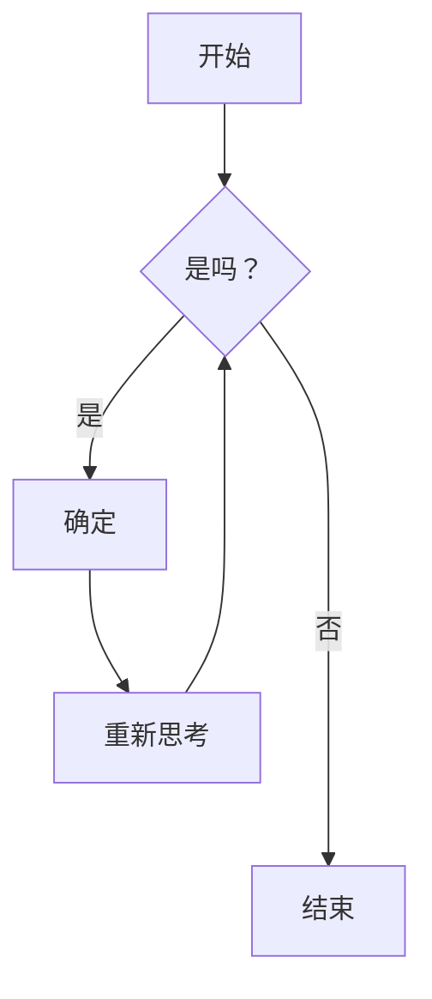



这是标题的示例。您可以通过以下 markdown 规则使用这些标题。例如：使用 `#` 表示一级标题，使用 `######` 表示六级标题。

# 一级标题

## 二级标题

### 三级标题

#### 四级标题

##### 五级标题

###### 六级标题

<hr>

### 强调

斜体，使用 _星号_ 或 _下划线_。

粗体，使用 **星号** 或 **下划线**。

组合强调 **星号和 _下划线_**。

删除线使用两个波浪号。~~删除这个。~~

<hr>

### 按钮



<hr>

### 链接

[我是一个内联样式链接](https://www.google.com)

[我是一个带标题的内联样式链接](https://www.google.com "Google 主页")

[我是一个相对引用的仓库文件](../blob/master/LICENSE)

URL 和尖括号中的 URL 将自动转换为链接。
<http://www.example.com> 或 <http://www.example.com>，有时
example.com（但在 Github 上不行）。

一些文本显示引用链接可以稍后跟随。

<hr>

### 段落

现代 Web 开发需要掌握多种技能和工具。从前端到后端，从设计到部署，每个环节都需要专业的知识和经验。通过不断学习和实践，我们可以提升自己的技能水平，创造出更优秀的产品。在这个快速变化的行业中，保持好奇心和学习热情是成功的关键。

<hr>

### 有序列表

1. 列表项
2. 列表项
3. 列表项
4. 列表项
5. 列表项

<hr>

### 无序列表

- 列表项
- 列表项
- 列表项
- 列表项
- 列表项

<hr>

### 提示框


这是一个简单的注释。



这是一个简单的引用。



这是一个简单的提示。



这是一个简单的信息。



这是一个简单的警告。


<hr>

### 选项卡




#### 嘿，我是一个选项卡

这是选项卡的内容示例。您可以在这里放置任何内容，包括文本、图片、代码等。选项卡是组织内容的好方法，可以让页面更加整洁和易于导航。





#### 关于内容组织

内容组织是网站设计的重要方面。通过合理的布局和结构，我们可以帮助用户更快地找到他们需要的信息。选项卡是一种有效的内容组织方式。

使用选项卡可以在有限的空间内展示更多的内容，同时保持页面的简洁性。这对于移动设备尤其重要。





#### 最佳实践

在使用选项卡时，应该确保每个选项卡的标题清晰明了，让用户一眼就能知道内容是什么。同时，默认显示的选项卡应该是最重要或最常用的内容。




<hr>

### 手风琴



- 提高用户体验和可访问性
- 优化页面加载速度和性能
- 确保代码的可维护性





- 使用 flexbox 或 grid 布局
- 设置适当的 margin 和 padding
- 考虑响应式设计





- 谨慎使用负边距
- 确保不会破坏布局
- 考虑其他替代方案



<hr>

### 代码和语法高亮

这是一个 `内联代码` 示例。

```javascript
var s = "JavaScript 语法高亮";
alert(s);
```

```python
s = "Python 语法高亮"
print s
```

```c  { linenos=true }
#include <stdio.h>

int main(void)
{
    printf("hello, world\n");
    return 0;
}
```



<hr>

### 引用块

> 优秀的代码不仅仅是能够运行，更重要的是清晰、可维护和高效。通过遵循最佳实践和编码标准，我们可以创造出经得起时间考验的软件。

<hr>

### 表格

| 表格          |    对齐方式    |  价格 |
| ------------- | :-----------: | ----: |
| 第 3 列       |    右对齐     | $1600 |
| 第 2 列       |    居中对齐    |   $12 |
| 斑马条纹      |    很整洁     |    $1 |

<hr>

### 图片



<hr>

### 画廊



<hr>

### 滑块



<hr>

### Youtube 视频



<hr>

### 自定义视频


